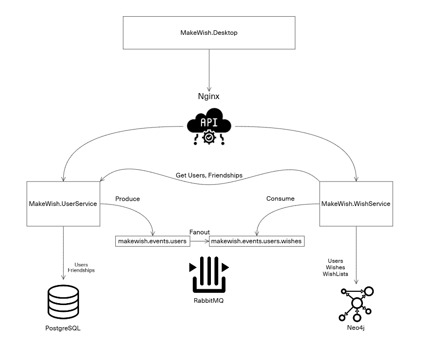
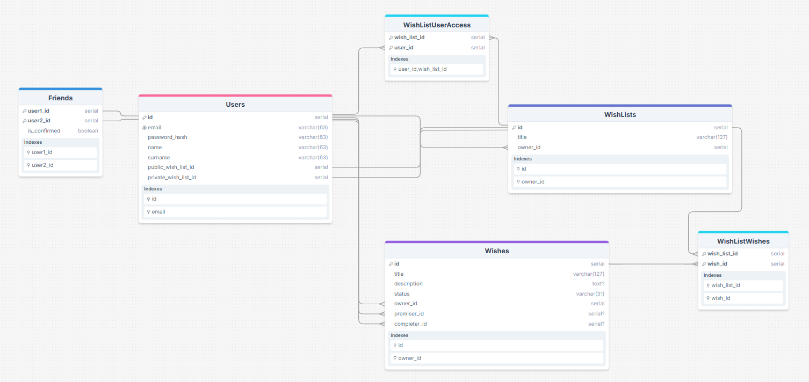
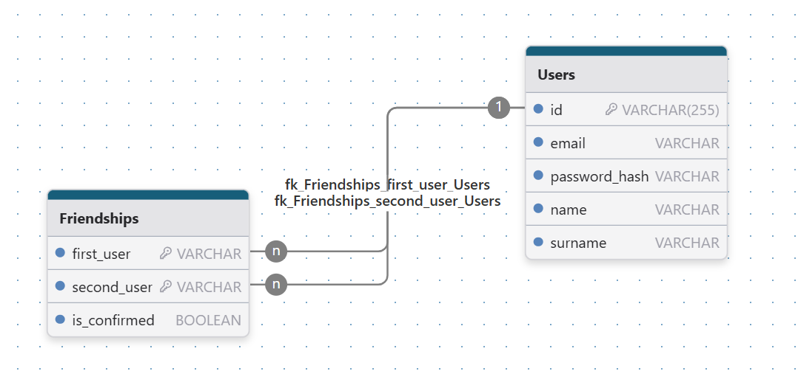
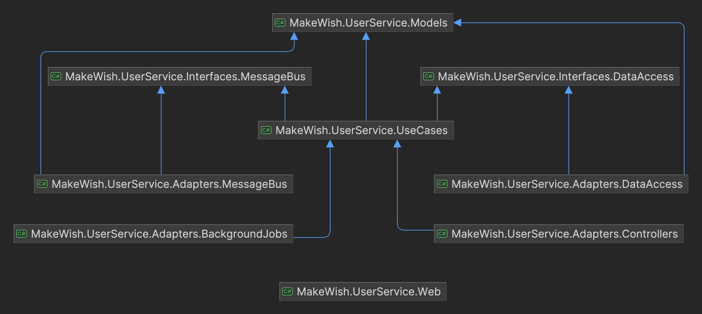
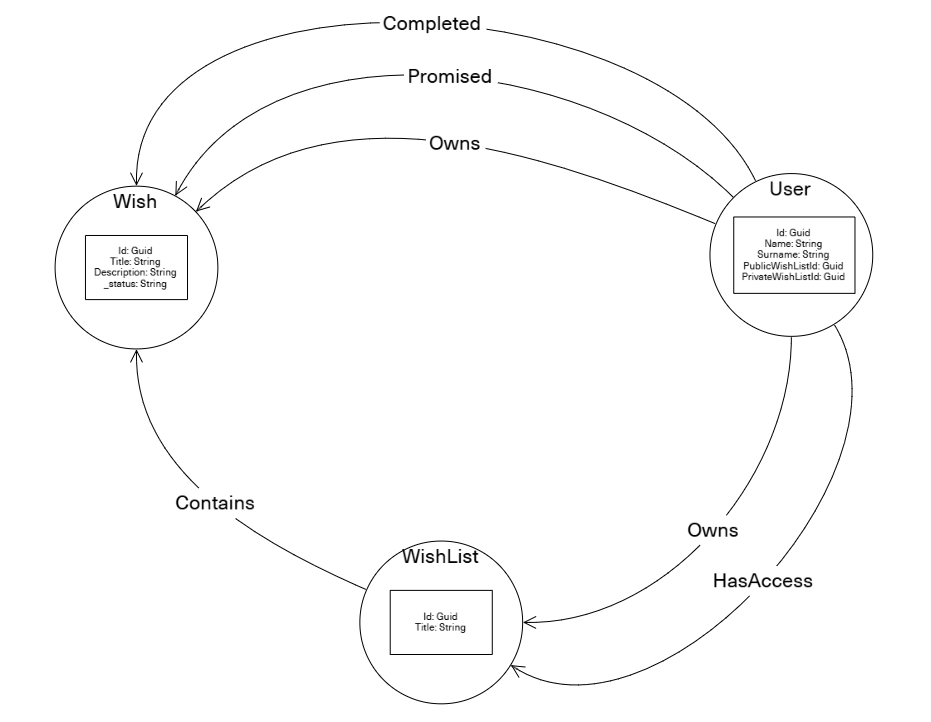
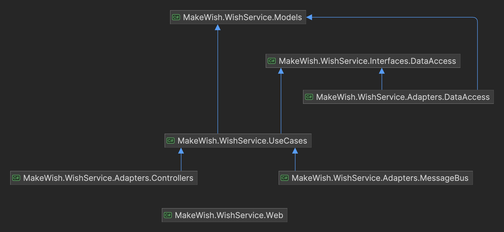

# MakeWish
Make Wish — сервис, в котором можно хранить список своих желаний. Каждый может посмотреть и выполнить желания своих друзей.

[Техническое задание](./docs/technical_task.md)

## Архитектура

## Общая схема базы данных
Схема представлена в том виде, если бы оба сервиса имели общую реляционную базу данных.

## UserService

### Схема базы данных

### Архитектура .NET проекта

## WishService

### Схема базы данных

### Архитектура .NET проекта

